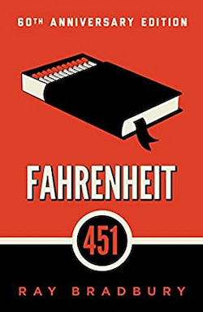

# Fahrenheit 481

Ray Bradbury - 1953

## Table of Contents

TODO: ADD TOC

## PART I - IT WAS A PLEASURE TO BURN

IT was a special pleasure to see things eaten, to see things blackened and changed.

With his symbolic helmet numbered 451 on his stolid head, and his eyes all orange flame with the thought of what came next, he flicked the igniter and the house jumped up in a gorging fire that burned the evening sky red and yellow and black.

The air seemed charged with a special calm as if someone had waited there, quietly, and only a moment before he came, simply turned to a shadow and let him through.

The girl stopped and looked as if she might pull back in surprise, but instead stood regarding Montag with eyes so dark and shining and alive, that he felt he had said something quite wonderful. But he knew his mouth had only moved to say hello, and then when she seemed hypnotized by the salamander on his arm and the phoenix-disc on his chest, he spoke again. "Of course," he said, "you're a new neighbour, aren't you?"

"Kerosene," he said, because the silence had lengthened, "is nothing but perfume to me.". "Does it seem like that, really?". "Of course. Why not?"

"Well," she said, "I'm seventeen and I'm crazy. My uncle says the two always go together. When people ask your age, he said, always say seventeen and insane. Isn't this a nice time of night to walk? I like to smell things and look at things, and sometimes stay up all night, walking, and watch the sun rise."

He saw himself in her eyes, suspended in two shining drops of bright water, himself dark and tiny, in fine detail, the lines about his mouth, everything there, as if her eyes were two miraculous bits of violet amber that might capture and hold him intact.

"Do you mind if I ask? How long have you worked at being a fireman?" "Since I was twenty, ten years ago." "Do you ever read any of the books you bum?" He laughed. "That's against the law!" "Oh. Of course."

"Is it true that long ago firemen put fires out instead of going to start them?" "No. Houses. have always been fireproof, take my word for it." "Strange. I heard once that a long time ago houses used to burn by accident and they needed firemen to stop the flames." He laughed.

"I don't mean to be insulting. It's just, I love to watch people too much, I guess."

"I sometimes think drivers don't know what grass is, or flowers, because they never see them slowly," she said. "If you showed a driver a green blur, Oh yes! he'd say, that's grass! A pink blur? That's a rose-garden! White blurs are houses. Brown blurs are cows. My uncle drove slowly on a highway once. He drove forty miles an hour and they jailed him for two days. Isn't that funny, and sad, too?"

I've lots of time for crazy thoughts, I guess.

Did you know that once billboards were only twenty feet long? But cars started rushing by so quickly they had to stretch the advertising out so it would last."

"Are you happy?" she said. "Am I what?" he cried. But she was gone-running in the moonlight. Her front door shut gently. "Happy! Of all the nonsense." He stopped laughing. He put his hand into the glove-hole of his front door and let it know his touch. The front door slid open. Of course I'm happy. What does she think? I'm not? he asked the quiet rooms. 

She had a very thin face like the dial of a small clock seen faintly in a dark room in the middle of a night when you waken to see the time and see the clock telling you the hour and the minute and the second, with a white silence and a glowing, all certainty and knowing what it has to tell of the night passing swiftly on toward further darknesses but moving also toward a new sun.

What incredible power of identification the girl had; she was like the eager watcher of a marionette show, anticipating each flicker of an eyelid, each gesture of his hand, each flick of a finger, the moment before it began. How long had they walked together? Three minutes? Five?

Darkness. He was not happy. He was not happy. He said the words to himself. He recognized this as the true state of affairs. He wore his happiness like a mask and the girl had run off across the lawn with the mask and there was no way of going to knock on her door and ask for it back.

His wife stretched on the bed, uncovered and cold... ...And in her ears the little Seashells, the thimble radios tamped tight, and an electronic ocean of sound, of music and talk and music and talk coming in, coming in on the shore of her unsleeping mind.

## PART II - THE SIEVE AND THE SAND

## PART III - BURNING BRIGHT

