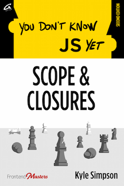

# You Don't Know JS Yet. Scope and Closures

Kyle Simpson - 2020

## Table of Contents

- Foreword
- Preface
- Chapter 1: What's the Scope?
    - About This Book
    - Compiled vs. Interpreted
    - Compiling Code
    - Compiler Speak
    - Cheating: Run-Time Scope Modifications
    - Lexical Scope
- Chapter 2: Illustrating Lexical Scope
    - Marbles, and Buckets, and Bubbles... Oh My!
    - A Conversation Among Friends
    - Nested Scope
    - Continue the Conversation
- Chapter 3: The Scope Chain
    - "Lookup" Is (Mostly) Conceptual
    - Shadowing
    - Function Name Scope
    - Arrow Functions
    - Backing Out
- Chapter 4: Around the Global Scope
    - Why Global Scope?
    - Where Exactly is this Global Scope?
    - Global This
    - Globally Aware
- Chapter 5: The (Not So) Secret Lifecycle of Variables
    - When Can I Use a Variable?
    - Hoisting: Yet Another Metaphor
    - Re-declaration?
    - Uninitialized Variables (aka, TDZ)
    - Finally Initialized
- Chapter 6: Limiting Scope Exposure
    - Least Exposure
    - Hiding in Plain (Function) Scope
    - Scoping with Blocks
    - Function Declarations in Blocks
    - Blocked Over
- Chapter 7: Using Closures
    - See the Closure
    - The Closure Lifecycle and Garbage Collection (GC)
    - Why Closure?
    - An Alternative Perspective
    - Closer to Closure
- Chapter 8: The Module Pattern
    - Encapsulation and Least Exposure (POLE)
    - What is a Module?
    - Node CommonJS Modules
    - Modern ES Modules (ESM)
    - Exit Scope
- Appendix A: Exploring Further
    - Implied Scopes
    - Anonymous vs. Named Functions
    - Hoisting: Functions and Variables
    - The Case for `var`
    - What's the Deal with TDZ?
    - Are Synchronous Callbacks Still Closures?
    - Classic Module Variations
- Appendix B: Practice
    - Buckets of Marbles
    - Closure (PART 1)
    - Closure (PART 2)
    - Closure (PART 3)
    - Modules
    - Suggested Solutions
