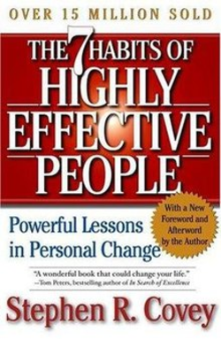
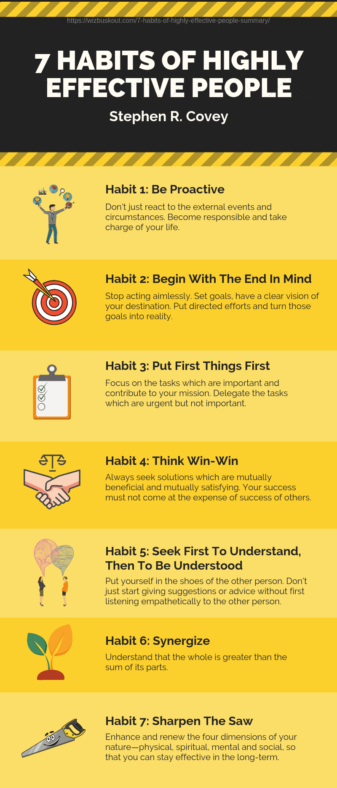

# The 7 habits of highly effective people

Stephen R. Covey - 1989

We must look at the lens through which we see the world, as well as at the world we see, and that the lens itself shapes how we interpret the world.

Search your own heart with all diligence for out of it flow the issues of life.

Eventually, if there isn't deep integrity and fundamental character strength, the challenges of life will cause true motives to surface and human relationship failure will replace short-term success.

As Emerson once put it, "What you are shouts so loudly in my ears I cannot hear what you say."

> Today we come across an individual who behaves like an automaton, who does not know or understand himself, and the only person that he knows is the person that he is supposed to be, whose meaningless chatter has replaced communicative speech, whose synthetic smile has replaced genuine laughter, and whose sense of dull despair has taken the place of genuine pain. Two statements may be said concerning this individual. One is that he suffers from defects of spontaneity and individuality which may seem to be incurable. At the same time it may be said of him he does not differ essentially from the millions of the rest of us who walk upon this earth.
> — Erich Fromm, an astute observer of the roots and fruits of the Personality Ethic.

"Inside-out" means to start first with self; even more fundamentally, to start with the most inside part of self---with your paradigms, your character, and your
motives. It says if you want to have a happy marriage, be the kind of person who generates positive energy and sidesteps negative energy rather than empowering it. If you want to have a more pleasant, cooperative teenager, be a more understanding, empathic, consistent, loving parent. If you want to have more freedom, more latitude in your job, be a more responsible, a more helpful, a more contributing employee. If you want to be trusted, be trust-worthy, If you want the secondary greatness of recognized talent, focus first on primary greatness of character.

> We are what we repeatedly do. Excellence, then, is not an act, but a habit.
> — Aristotle.

OUR CHARACTER, BASICALLY, is a composite of our habits. "Sow a thought, reap an action; sow an action, reap a habit; sow a habit, reap a character; sow a character, reap a destiny," the maxim goes.

Effectiveness lies in the balance---what I call the P/PC Balance. P stands for production of desired results, the golden eggs. PC stands for production capability, the ability or asset that produces the golden eggs.

Always treat your employees exactly as you want them to treat your best customers.

> No one can persuade another to change. Each of us guards a gate of change that can only be opened from the inside. We cannot, open the gate of another, either by argument or by emotional appeal.
> — Marilyn Ferguson.

One day, naked and alone in a small room, he began to become aware of what he later called "the last of the human freedoms"- the freedom his Nazi captors could not take away. They could control his entire environment, they could do what they wanted to his body, but Viktor Frankl himself was a self-aware being who could look as an observer at his very involvement. His basic identity was intact. He could decide within himself how all of this was going to affect him. Between what happened to him, or the stimulus, and his response to it, was his freedom or power to choose that response.

Between stimulus and response, man has the freedom to choose.

As Eleanor Roosevelt observed, "No one can hurt you without your consent." In the words of Gandhi, "They cannot take away our self respect if we do not give it to them." It is our willing permission, our consent to what happens to us, that hurts us far more than what happens to us in the first place.

"But how do you love when you don't love?", "My friend, love is a verb. Love---the feeling---is a fruit of love, the verb. So love her. Serve her. Sacrifice. Listen to her. Empathize. Appreciate. Affirm her. Are you willing to do that?"

> Things which matter most must never be at the mercy of things which matter least.
> — Goethe.

But you have to decide what your highest priorities are and have the courage--pleasantly, smilingly, nonapologetically-- to say "no" to other things. And the  way you do that is by having a bigger "yes" burning inside. The enemy of the "best" is often the "good."

The way you spend your time is a result of the way you see your time and the way you really see your priorities.

Make what is important to the other person as important to you as the other person is to you.

In relationships, the little things are the big things.

The essence of empathic listening is not that you agree with someone; it's that you fully, deeply, understand that person, emotionally as well as intellectually.

This is one of the greatest insights in the field of human motivation: _Satisfied needs do not motivate_. It's only the unsatisfied need that motivates. Next to physical survival, the greatest need of a human being is psychological survival--to be understood, to be affirmed, to be validated, to be appreciated.

When you listen with empathy to another person, you give that person psychological air. And after that vital need is met, you can then focus on influencing or problem solving.

People who patiently persist finally see their dreams come true.

If you don't have confidence in the diagnosis, you won't have confidence in the prescription.

This principle is also true in sales. An effective sales person first seeks to understand the needs, the concerns, the situation of the customer. The amateur salesman sells products; the professional sells solutions to needs and problems. It's a totally different approach.

> You have control over three things – what you think, what you say, and how you behave. To make a change in your life, you must recognize that these gifts are the most powerful tools you possess in shaping the form of your life.
> — Sonia Friedman.

The whole is greater than the sum of its parts. One plus one equals three or more.

All people see the world, not as it is, but as they are.

The person who doesn't read is no better off than the person who can't read.

If our personal security comes from sources within ourselves, then we have the strength to practice the habits of Public Victory. If we are emotionally insecure, even though we may be intellectually very advanced, practicing Habits 4, 5, and 6 with people who think differently on jugular issues of life can be terribly threatening. 
Where does intrinsic security come from? It doesn't come from what other people think of us or how they treat us. It doesn't come from the scripts they've handed us. It doesn't come from our circumstances or our position. 
It comes from within. It comes from accurate paradigms and correct principles deep in our own mind and heart. It comes from inside-out congruence, from living a life of integrity in which our daily habits reflect our deepest values.

I believe that a life of integrity is the most fundamental source of personal worth. I do not agree with the popular success literature that says that self-esteem is primarily a matter of mind set, of attitude--that you can psych yourself into peace of mind.

By the way here is a Guide with the 7 habits of highly effective people. 

 [Read:](Read/index.md) [2020](Read/2020.md) [Genre:](Genre/index.md) [Personal Growth](Genre/Personal%20Growth.md) [Self-help](Genre/Self-help.md) [Success](Genre/Success.md)